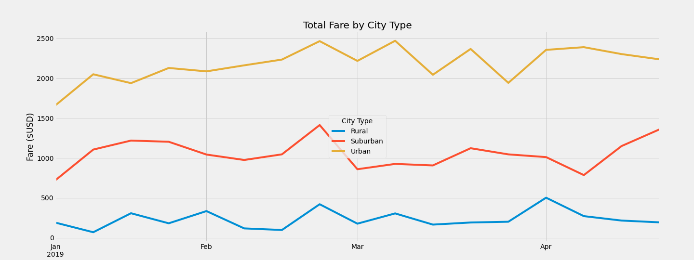

# PyBer_Analysis

## Overview of Project

### Purpose
The purpose of this project is to provide data visualization techniques to give insight into the data from a ride sharing company called PyBer. The visualizations will be presented to the CEO of PyBer.

## Results

### Images for Reference

### Data Description

The dataframe summary indicates that there are significantly more rides in Urban cities than Suburban or Rural cities. The number of drivers correlates with more rides as the pattern shows that the most drivers work in Urban cities. The average fare per driver and are most expensive in the rural areas and cheaper in the Urban cities. This tells us that as a ride share service has more drivers available the ride expenses or fares become cheaper on average. However, it is interesting to note that a missing piece of crucial data is the time length of each ride. Theoretically because rural areas could require rides of a longer distance, the data could be skewed. This is because the longer the ride, the higher the fare. 

## Summary

In conclusion, I recommend that the CEO hires more drivers in Urban areas, hires around the same amount of drivers in Suburban areas, and fires more drivers in Rural cities. This is because Urban areas bring in the most revenue, so adding more capital in drivers can increase revenue. In Suburban areas, there are less PyBer's being called than Urban areas. However, there are still enough being called that I believe an increase in drivers and presence in Suburban areas could be beneificial in the future for at least the branding of PyBer. I believe that drivers will be replaced by autonomous vehicles in the near future, so an establishment of brand in suburban areas could be beneficial. Finally, I believe that Rural cities are not worth drivers time, and they should focus on suburban and urban areas where there is more wealth, people, and a need for less cars in more densely populated areas.
